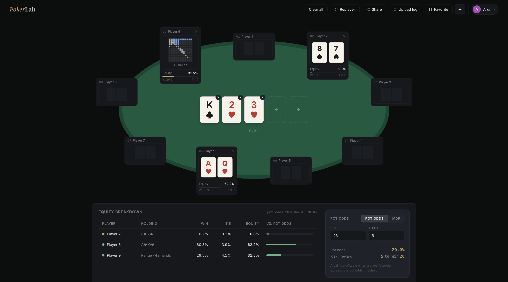

## PokerLab

#### Texas Hold'Em analytics platform for hand/range equity, pot odds/MDF, and hand-history replay.



PokerLab lets you deal hole cards, assign ranges, and set the board, then computes each player’s equity using a Monte Carlo simulation. It also includes a side panel for calculating pot odds and MDF in the current spot. You can import PokerNow logs into the replayer, share exact board states or replays, and review past hands from your profile page.

## Architecture

```text
+----------------------------------------------------------+
|                     Users / Browsers                     |
|                                                          |
|                       pokerlab.dev                       |
+----------------------------------------------------------+
                             |
                           HTTPS
                             |
+----------------------------------------------------------+
|              Frontend  ·  Vite + React SPA               |
|                                                          |
|     Equity Calculator · Hand Replayer · Share links      |
|      Equity Web Worker · Monte Carlo (client-side)       |
+----------------------------------------------------------+
                             |
                /api/*  ·  same-origin proxy
                             |
+----------------------------------------------------------+
|                 Backend  ·  Next.js API                  |
|                                                          |
|         NextAuth v5 · Credentials + Google · JWT         |
|      /api/searches · saved-hand CRUD · rate-limited      |
+----------------------------------------------------------+
                             |
                             |
+----------------------------------------------------------+
|                     Data & Services                      |
|                                                          |
|  Neon Postgres (Prisma) · Upstash Redis · Google OAuth   |
+----------------------------------------------------------+
```

## Quick start guide

```bash
# Frontend (Vite + React)
cd frontend
npm install
npm run dev          # http://localhost:5173

# Backend (Next.js, NextAuth, Prisma)
cd backend
npm install
npm run dev          # http://localhost:3000
```

See [`frontend/README.md`](./frontend/README.md) and [`backend/README.md`](./backend/README.md) for details, and [`backend/setup.md`](./backend/setup.md) for the auth/DB setup walkthrough.
